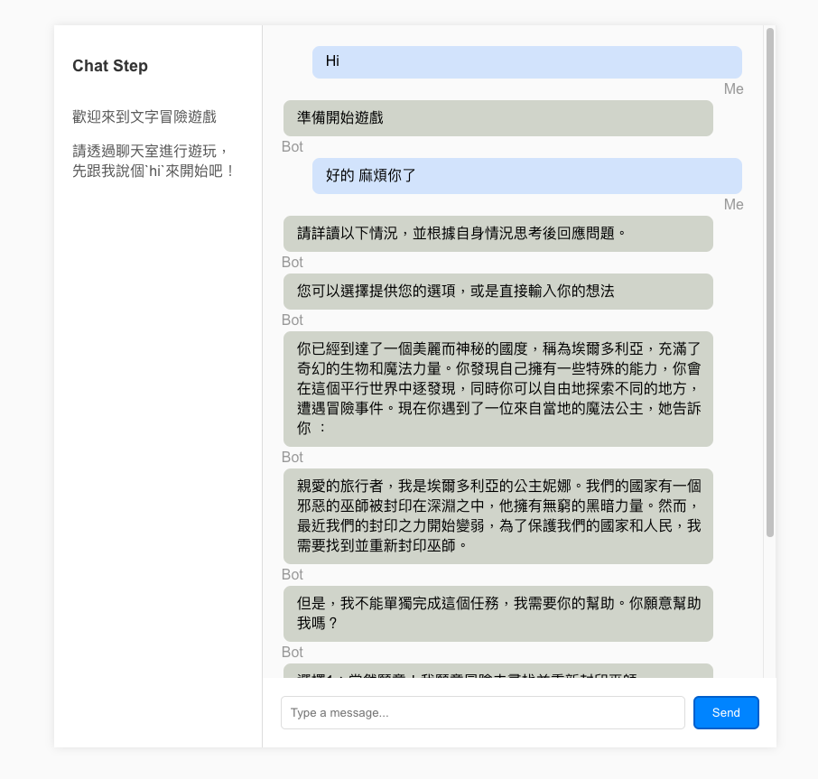
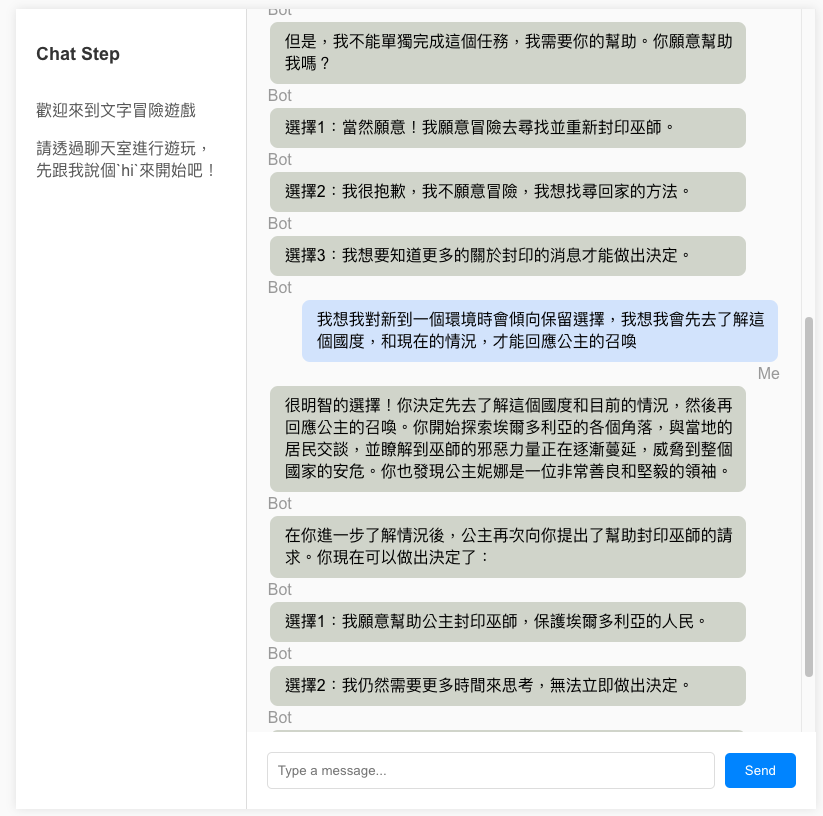
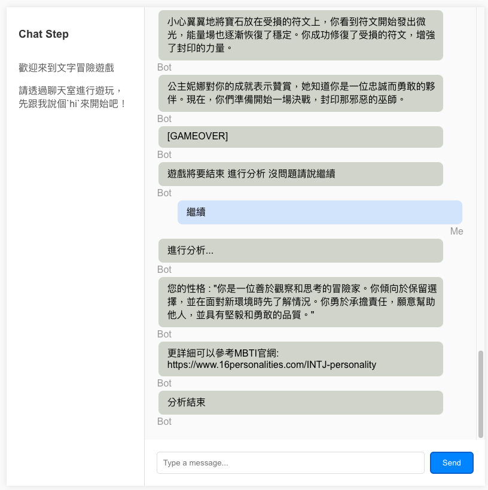

# RASA
This is a mentor bot that can help to analysis user personality, built with rasa framework and LLM. We design idea from ChatDev, try to build a step-by-step framework. while user interactive with bot, we will create a story by LLM to collect response of user. And then give a user's personality report. 

# Design

```

rules:
- **
  - story: introduction to user
    steps:
      - slot_was_set:
        - welcome_stage: true
      - or:
        - intent: user_response
        - intent: user_greet
        - intent: user_confirm
      - action: utter_introduct_the_bot_game
      - action: action_solt_story_stage_set_started
      - action: action_solt_welcome_stage_set_false

  - story: start to response to bot's story
    steps:
      - intent: user_response
      - slot_was_set:
        - welcome_stage: false
        - story_started: true
      - action: action_ask_gpt_extend_story
      - action: action_solt_story_started_set_false
      - action: action_solt_story_finished_set_true

  - story: finish the game 
    steps:
      - slot_was_set:
        - story_started: false
        - story_finished: true
      - intent: user_confirm
      - action: action_ask_gpt_analysis_story

```

- more config
```
intents:
  - intent: user_response
  - intent: user_greet
  - intent: user_confirm  

regex: user_response
  examples: |
    - ^/我覺得.*$
    - ^/我想要.*$
    - ^/我會.*$

regex: user_confirm
  examples: |
    - ^/.*好的.*$
    - ^/.*繼續.*$
    - ^/.*開始.*$
    - ^/.*沒問題.*$

actions:
  - utter_introduct_the_bot_game
  - utter_story_start
  - utter_will_finish_story
  - action_solt_welcome_stage_set_false
  - action_solt_story_stage_set_started
  - action_solt_story_stage_set_finished
  - action_ask_gpt_analysis_story
  - action_ask_gpt_extend_story

slots:
  story_started:
    type: bool
    initial_value: false
    mappings:
      - type: custom
  story_finished:
    type: bool
    initial_value: false
    mappings:
      - type: custom
  welcome_stage:
    type: bool
    initial_value: true

```
### Design Demo




### Game Demo

- `根據選擇來推動故事`


- `根據過程來分析使用者性格`



# Service

### Start Service
1. Update OpenAIAPI Key in docker-compose.yml
2. Update Domain name in botroom(frontend)
3. up service with docker-compose
```
docker-compose up
```
4. go to weeb
```
http://127.0.0.1
```

### ask bot by cmd
```
curl -o output.txt -X POST -H "Content-Type: application/json; charset=UTF-8" -d '{"sender": "user-001","message": "早安"}'  http://127.0.0.1:5005/webhooks/rest/webhook && echo -e "$(<output.txt)"
curl -o output.txt -X POST -H "Content-Type: application/json; charset=UTF-8" -d '{"sender": "user-001","message": "昆蟲是甚麼?"}'  http://127.0.0.1:5005/webhooks/rest/webhook && echo -e "$(<output.txt)"
curl -o output.txt -X POST -H "Content-Type: application/json; charset=UTF-8" -d '{"sender": "user-001","message": "是的"}'  http://127.0.0.1:5005/webhooks/rest/webhook && echo -e "$(<output.txt)"
```


# Testing
- wth rasa tests
```
docker-compose up test-model
```


